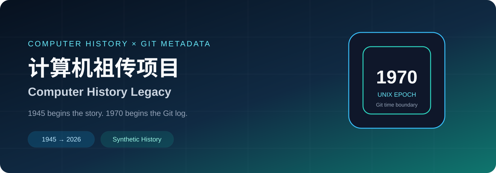
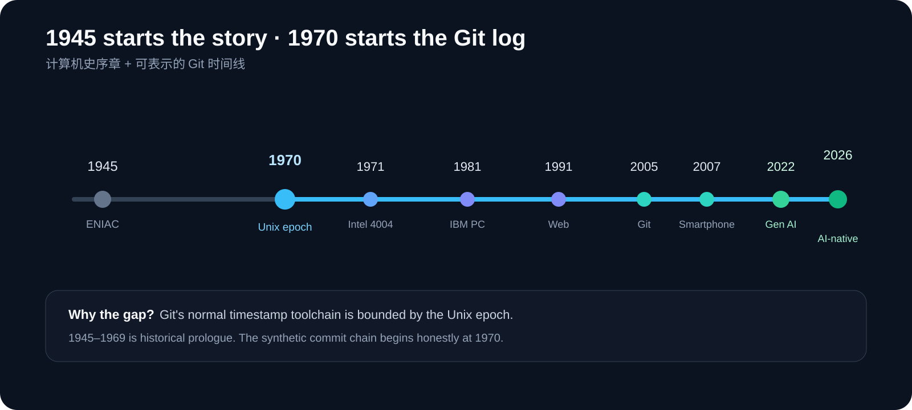
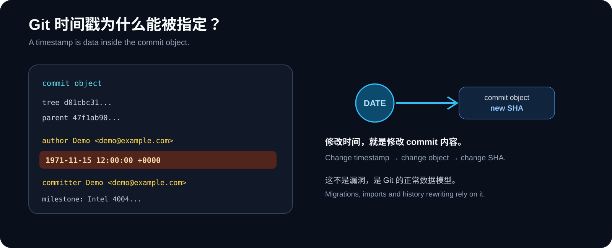

# Computer History Legacy / 计算机祖传项目

**Writing the history of computing into a Git log.**

[简体中文](./README.md) · [English](./README_EN.md)

<code>1945 → 2026</code> · <code>Git Metadata Lab</code> · <code>Computer History</code>

> [!IMPORTANT]
> **This is not a software project that has actually been developed since 1945.**  
> It is a clearly disclosed Git metadata experiment that simulates an “ancestral” repository while telling a compact history of computing.

## The most interesting result

We genuinely tried to place the first commit in **1945**.

What happened:

- Local Git rejected a normal 1945 commit date.
- GitHub's Git Data API accepted the 1945 ISO input, but stored the resulting commit at **1970-01-01 00:00:00 UTC**.
- Git's standard commit time is represented as a Unix timestamp, so the practical boundary of the normal toolchain is the Unix epoch.

That gave the project a better story:

> **Computing history begins in 1945, but the Git time machine can only reverse to 1970.**

## Computing history, written into Git

| Year | Milestone | Meaning |
|---:|---|---|
| 1945 | ENIAC completion era | Prologue to the timeline |
| 1970 | Unix epoch | The repository's real Git history begins |
| 1971 | Intel 4004 | Microprocessor era |
| 1981 | IBM PC | Personal computing goes mainstream |
| 1991 | World Wide Web | The Web era |
| 2005 | Git | Software history is recorded differently |
| 2007 | Smartphone era | Computing enters the pocket |
| 2022 | Generative AI | Large models reach mainstream users |
| 2026 | AI-native | From clicking software to delegating goals to agents |

Open the **Commits** page and you will see an annual chain from **1970 → 2026**.  
The years 1945 → 1969 remain a computing-history prologue because we do not want to pretend GitHub can display dates it cannot faithfully represent.

## How can Git “change time”?

A Git commit records author, committer and timestamps. The timestamp is part of the commit object itself.

~~~bash
GIT_AUTHOR_DATE="1971-11-15T12:00:00+0000" \
GIT_COMMITTER_DATE="1971-11-15T12:00:00+0000" \
git commit -m "milestone: Intel 4004 starts the microprocessor era"
~~~

So: **change the timestamp → change the commit object → change the SHA.**

This is not a vulnerability. Migrations, imports, testing and history rewriting legitimately use these capabilities.

## Explore

- [docs/HOW_IT_WORKS.md](docs/HOW_IT_WORKS.md) — Git timestamps and commit objects
- [docs/YEARBOOK.md](docs/YEARBOOK.md) — the ledger that really grows year by year
- [docs/SOURCES.md](docs/SOURCES.md) — historical sources
- [scripts/rebuild-history.sh](scripts/rebuild-history.sh) — reproducible experiment

## One reminder

To judge how old a project really is, **do not rely on commit dates alone**. Consider repository creation time, releases, issues, PRs, signatures, package publication dates, mailing lists and external archives.

### If the 1970 commit made you stop for three seconds, the repository did its job.

**It is not a time machine. It is Git.**

[← 阅读中文版](./README.md)

